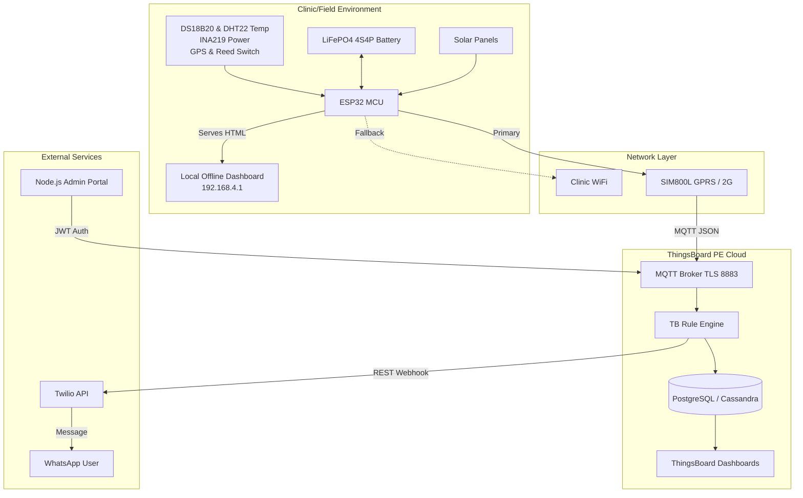
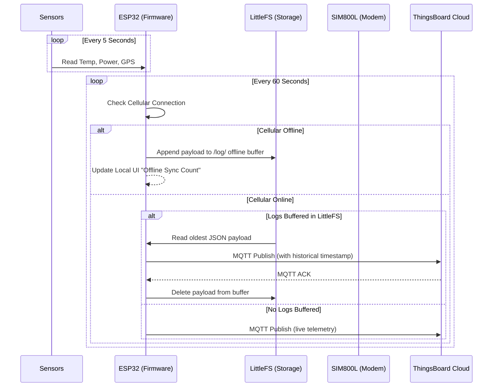
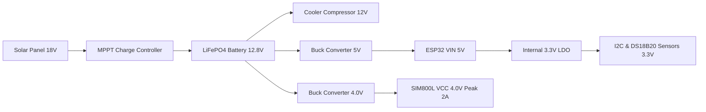
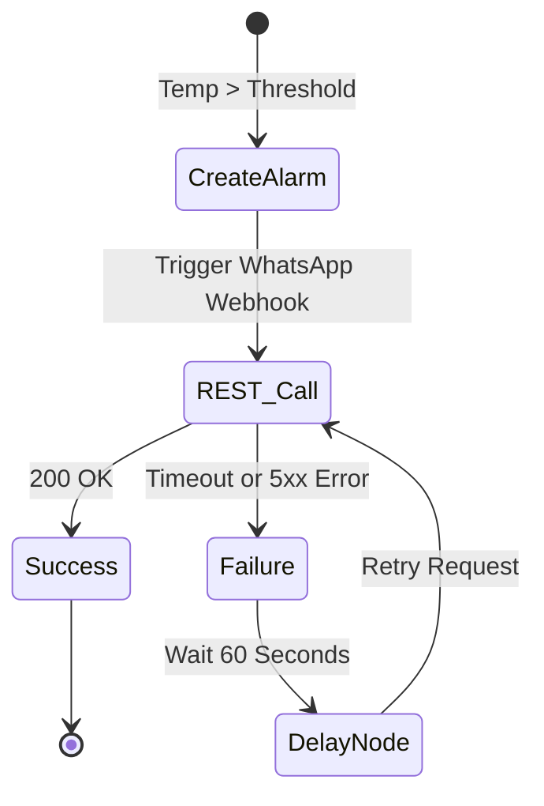

# CoolCycle System Architecture

This document visually describes the data flows, connectivity, and hardware integration of the CoolCycle Medical Cold Chain Monitoring System.

## High-Level System Architecture

## Offline-to-Online Telemetry Sync Flow

## Hardware Component Power Tree

## Twilio Webhook Retry Logic (Rule Chain)

